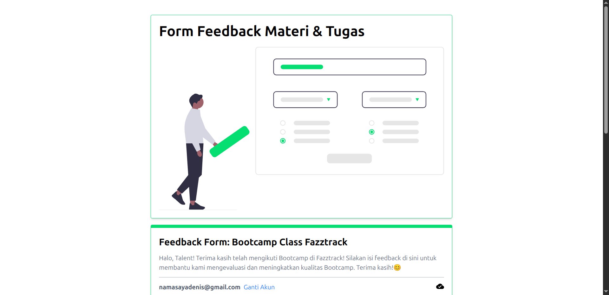

# React Form with Redux


## Description

This project is a basic React application scaffolded with Vite, styled using Tailwind CSS, and powered by a Node.js environment. It is developed as part of the FGO24 (Full-stack Golang 2024) bootcamp to demonstrate redux in react works by building a google form clone

## Preview



## ✨ Features

- Fast development environment with Vite
- Component-based architecture using React
- Utility-first styling with Tailwind CSS
- Ready for integration with Node.js backends
- Responsive design out-of-the-box

## 🛠️ Technologies Used

- React
- Redux
- React Hook Form 
- Tailwind CSS (soon)
- Node.js
- Vite

## 📋 Prerequisites

Before running this project, ensure you have:

- [Node.js](https://nodejs.org/) (recommended version 16+)
- [npm](https://www.npmjs.com/) or [yarn](https://yarnpkg.com/)
- A code editor (recommended: [VS Code](https://code.visualstudio.com/))

## 🚀 Getting Started

### Cloning the Repository

```bash
git clone https://github.com/devbydenis/fgo24-react-redux.git
cd fgo24-react-redux
```

### Installing Dependencies

```bash
npm install
# or
yarn install
```

### Running the Development Server

```bash
npm run dev
# or
yarn dev
```

The app will be available at `http://localhost:5173` by default.

### Docker Deployment

1. **Build the Docker image**
   ```bash
   docker build -t image-react-form .
   ```

2. **Run the container**
   ```bash
   docker run -d --name container-react-form -p 8080:80 image-react-form
   ```

3. **Access the application**
   Open your browser and go to `http://localhost:8080`

## 📱 Responsive Design

The UI is fully responsive, leveraging Tailwind CSS to ensure seamless display across devices. All components are mobile-friendly and adapt to various screen sizes.

## 📚 Project Structure

```
fgo24-react-redux/
├── public/                # Static assets
├── src/
│   ├── assets/            # Images and media
│   ├── components/        # Reusable React components
│   ├── pages/             # pages consist of component
│   ├── App.jsx            # Main App component
│   ├── main.jsx           # Entry point
│   └── index.css          # Tailwind CSS imports
├── package.json           # Project metadata and scripts
├── tailwind.config.js     # Tailwind CSS configuration
├── vite.config.js         # Vite configuration
└── README.md              # This file
```

## 🧠 Learning Outcomes

- Setting up a React project with Vite
- Using Tailwind CSS for rapid UI development
- Structuring React components efficiently
- Integrating modern JavaScript tooling
- Preparing for full-stack development with Node.js

## 🔄 Contribution

Contributions are welcome! To contribute:

1. Fork this repository
2. Create a new branch (`git checkout -b feature-branch`)
3. Commit your changes (`git commit -m 'Add new feature'`)
4. Push to your branch (`git push origin feature-branch`)
5. Open a Pull Request

## 📜 License

[MIT](https://choosealicense.com/licenses/mit/)

## 📞 Contact

Denis Rahmadi - [GitHub](https://github.com/devbydenis)

Project Link: [https://github.com/devbydenis/fgo24-react-redux](https://github.com/devbydenis/fgo24-react-redux)

---

Made by Denis Rahmadi

Citations:
[1] https://ppl-ai-file-upload.s3.amazonaws.com/web/direct-files/attachments/69746963/f7d84211-324f-4c30-990e-857903da42f3/format-readme.txt
[2] https://github.com/devbydenis/fgo24-react-redux.git.
[3] https://ppl-ai-file-upload.s3.amazonaws.com/web/direct-files/attachments/69746963/f7d84211-324f-4c30-990e-857903da42f3/format-readme.txt
[4] https://github.com/devbydenis/fgo24-react-redux.git.

---